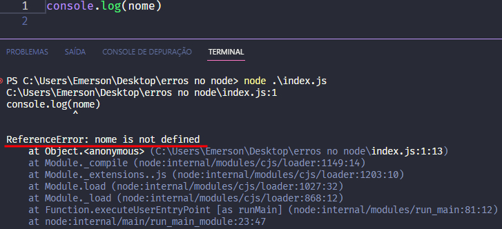
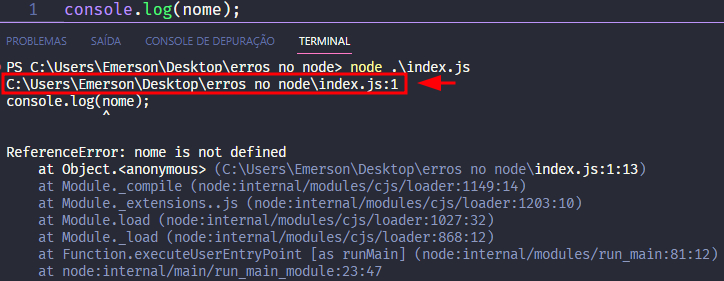
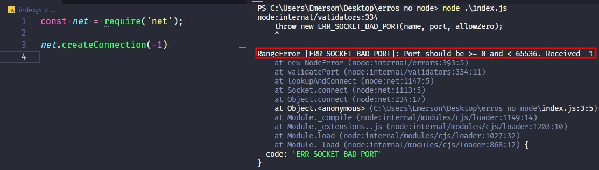
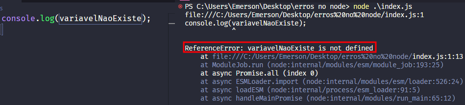
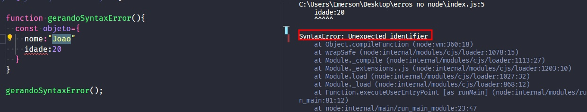
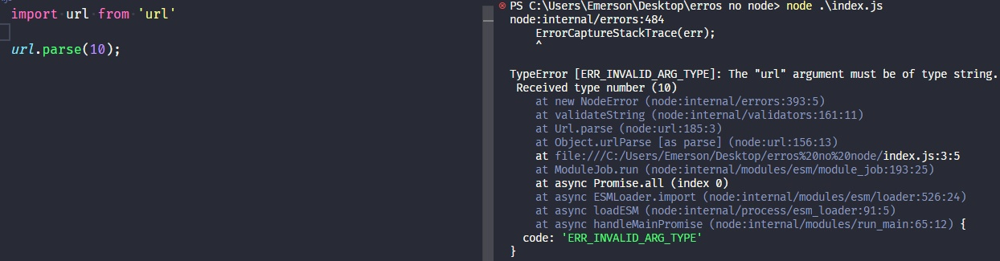
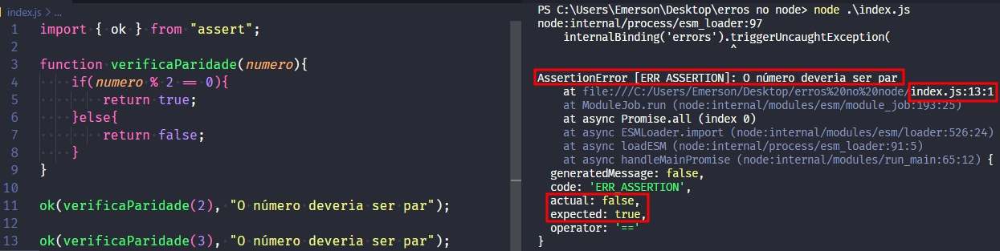
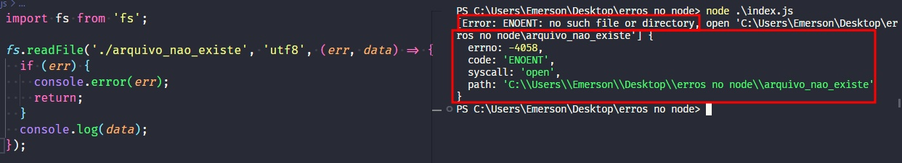

# Lidando com erros no Node.js

## Introdução

Erros fazem parte da rotina de qualquer pessoa desenvolvedora, bem como saber como resolvê-los.

Quando falamos de Node.JS, a maioria das informações que nos ajudam a resolver erros estão espalhadas em vários vídeos e postagem em fóruns. Por isso, podemos ter a sensação de que estamos levando mais tempo do que o necessário para resolver esses problemas. Além disso, nos deparamos com siglas que, inicialmente, parecem “misteriosas” como: EADDRINUSE, ENOTFOUND, ECONNREFUSED, dentre outras, e isso nos faz passar ainda mais tempo pesquisando o que são essas siglas.

Por isso, pensando em facilitar seu dia a dia, neste artigo entenderemos como ler um erro, quais são os principais erros que vemos no **Node.js**, as possíveis causas desses erros e como podemos resolvê-los.

## Lendo um erro

Imagine o seguinte cenário: você está começando na programação, usa o console.log e passa como parâmetro uma variável que esqueceu de criar. Crendo que tudo está certo, você executa o seu código, como na imagem a seguir:



Um mar de palavras surge, parece ter erros até mesmo em pastas que você nem sabia que existia (node:internal/modules ? Module.load?) e o desespero de não saber o que fazer aumenta. Mas calma! Vamos entender por partes o que está acontecendo na imagem acima.

A primeira informação que recebemos é o ponto onde nosso código foi finalizado, indicando **em qual arquivo aconteceu o erro** e o sinal de dois pontos (:), seguido do valor 1, indicando **a linha onde o erro aconteceu**:



## A classe Error

No geral, quando ocorre um erro no Node.js, ele será de uma das quatro categorias de erros:

- Erros padrão de JavaScript, como **SyntaxError**, **RangeError**, **ReferenceError**, **TypeError**;

- Erros do sistema, chamados pelo sistema operacional quando, por exemplo, tentamos abrir um arquivo que não existe;

- Erros personalizados pelo usuário e que serão usados no seu código;

- **AssertionErrors**, uma classe especial de erro que pode ser acionada quando o Node.js detecta uma violação lógica que não deveria ocorrer, como em um teste que falhou. Mais à frente, ainda neste artigo, vamos estudar sobre essa classe.

Porém, antes de conhecermos essas classes, é preciso entender que todos os erros de JavaScript e de sistema gerados pelo Node.js são herdados ou são instâncias da classe JavaScript `Error`. Com isso, todas essas categorias de classes possuem propriedades em comum, como:

### error.name

Nos indica a classe de Erro gerada. No exemplo anterior, tivemos `RefenceError`;

### error.code

Uma string que representa um identificador para tal erro;

### error.message

A propriedade `message` é a descrição da string do erro conforme definido (pelo usuário, ao criar uma instância de erro ou pelo próprio Node.js). Essa mesma mensagem aparecerá na primeira linha da stacktrace do erro;

### error.stack

O ponto do código onde a classe Error foi instanciada, seguido do caminho percorrido pelo erro;

No exemplo anterior, outra forma de visualizar seria:

```
try {
  console.log(nome)

} catch (erro) {
  console.log(`O nome do erro é: ${erro.name}\n`)
  console.log(`A mensagem de erro é: ${erro.message}\n`)
  console.log(`A stack do erro é: ${erro.stack}\n`)}
 // usamos o \n acima para pular uma linha extra e visualizarmos melhor
```

E teriamos como saída:

```
O nome do erro é: ReferenceError

A mensagem de erro é: nome is not defined

A stack do erro é: ReferenceError: nome is not defined
    at Object.<anonymous> (C:\Users\Emerson\Desktop\erros no node\index.js:2:15)
    at Module._compile (node:internal/modules/cjs/loader:1149:14)
    at Module._extensions..js (node:internal/modules/cjs/loader:1203:10)
    at Module.load (node:internal/modules/cjs/loader:1027:32)
    at Module._load (node:internal/modules/cjs/loader:868:12)
    at Function.executeUserEntryPoint [as runMain] (node:internal/modules/run_main:81:12)
    at node:internal/main/run_main_module:23:47
```

Ou seja, além de lermos os erros, é possível “capturar” o conteúdo de um erro (suas propriedades) e com isso criarmos nossas próprias formas de lidar com eles - por exemplo, criar mensagens personalizadas, gerar um aviso para o usuário, entre várias outras opções.

## Entendendo as diferentes classes de erro

Você concorda comigo que o Node.js poderia chamar toda falha inesperada de erro? Afinal, se ocorreu um erro, nada mais justo que criar a classe Error e tratá-la com os métodos que vimos no tópico anterior.

Mas, pensando na infinidade de erros que podem acontecer, o Node.js usa do conceito de herança para criar diferentes classes de erros. Assim fica muito mais claro para a pessoa desenvolvedora que tipo de erro é esse, cada um com uma mensagem personalizada indicando o porquê do erro ter acontecido.

As classes que vamos apresentar neste tópico estendem a classe Error. Ou seja, têm a classe Error como pai e usam as funcionalidades dela, porém, cada nova classe que veremos tem diferentes aplicabilidades.

### RangeError

Essa classe de erro é padrão de JavaScript e ocorre quando passamos um argumento fora do intervalo (ou em inglês, range) esperado de uma função.

No exemplo abaixo, nós estamos importando o módulo net e usando a função createConnection, responsável por criar uma conexão socket. Não se preocupe se não souber o que é uma conexão socket, nesse exemplo não entraremos nas suas funcionalidades. 

O primeiro parâmetro da função createConnection é a porta que estará conectada e os valores aceitos de portas vão de 0 até 65536. Então, se passamos um valor como -1, recebemos um erro informando que este valor está fora do intervalo permitido.



### ReferenceError

Essa classe de erro, também padrão de JavaScript, ocorre quando tentamos acessar uma variável que não está definida. Ela, geralmente, indica erros de digitação no código ou um programa quebrado (como algum bug nas dependências do seu projeto).



### SyntaxError

Essa classe de erro, padrão de JavaScript, ocorre ao tentar interpretar código sintaticamente inválido. Ou seja, quando digitar algo que não está conforme a sintaxe da linguagem.

No exemplo abaixo, foi criada e chamada a função gerandoSyntaxError em que propositalmente não foi colocada a vírgula para separar as propriedades do objeto. A regra sintática do JavaScript é que as propriedades de um objeto devem ser separadas por vírgula, uma vez que a pessoa desenvolvedora não segue essa regra, recebe um erro de sintaxe.



### TypeError

Essa classe de erro indica que um argumento fornecido não é um tipo permitido. Por exemplo, uma função que espera receber um tipo específico como parâmetro, mas recebe outro, seria um TypeError, como mostrado abaixo - onde o método parse espera uma string, mas recebe um número.



```
Cuidado para não confundir TypeError (erro de tipo) com a palavra “type” que também pode significar “digitar”.
```

### AssertionError

O assert é, de forma resumida, um módulo JavaScript que permite testar nossas expressões.



No exemplo acima, eu importei um método chamado `ok`, que verifica se dada informação possui o valor true. Caso seja `true`, nada acontece.

Para testar essa funcionalidade, foi criada uma função chamada `verificaParidade` que retorna true para valores pares e false para valores ímpares.

Quando passamos como parâmetro do método `ok` a função `verificaParidade` de um número par, nada acontece (conforme o esperado). Porém, na linha 13 da imagem acima, ao passarmos para a função um valor que retornará false (o número 3), o AssertionError entra em ação.

O programa é finalizado e um `AssertionError` é lançado com a mensagem que escrevemos (“O número deveria ser par”), que podemos ver à direita da imagem. Além disso, podemos observar uma indicação do valor atual (actual:false) e o valor esperado `(expected:true)`.

Em resumo, o AssertionError será exibido sempre que nossa verificação do assert falhar. Esta é uma das bases de funcionamento dos chamados testes unitários.

### SystemError

O SystemError (em português, erro de sistema) acontece quando cometemos alguma violação do sistema operacional enquanto executamos nosso código, como ler um arquivo que não existe.



Olha só que interessante, na imagem acima, o SystemError `retornou um objeto com algumas propriedades comoerrno,code,syscallepath`. Esse retorno visa ajudar a pessoa desenvolvedora a entender as características do erro que está sendo recebido. Vamos entender o que cada um significa?

- `errno`: representa o número do erro fornecido pelo sistema, um identificador do erro;

- `code`: é uma string que representa o código de erro, no exemplo acima, ENOENT, indicando que não foi encontrado arquivo com o nome fornecido;

- `syscall`: é uma string que descreve a chamada de sistema que falhou, no exemplo acima foi a chamada open, que foi literalmente o que o programa tentou fazer: abrir (open) um arquivo;

- `path`: o caminho do arquivo que fornecemos.

Além dessas propriedades, também encontramos, para a classe `SystemError`, as seguintes propriedades:

address: o endereço para o qual uma conexão de rede falhou;
dest: o destino do caminho do arquivo ao relatar um erro do sistema de arquivos;
info: detalhes extras sobre a condição de erro;
message: uma descrição legível (uma frase, não um código) do erro fornecida pelo sistema;
port: a porta de conexão de rede que não está disponível.

[Variaveis](../Variaveis/Variaveis.md)


