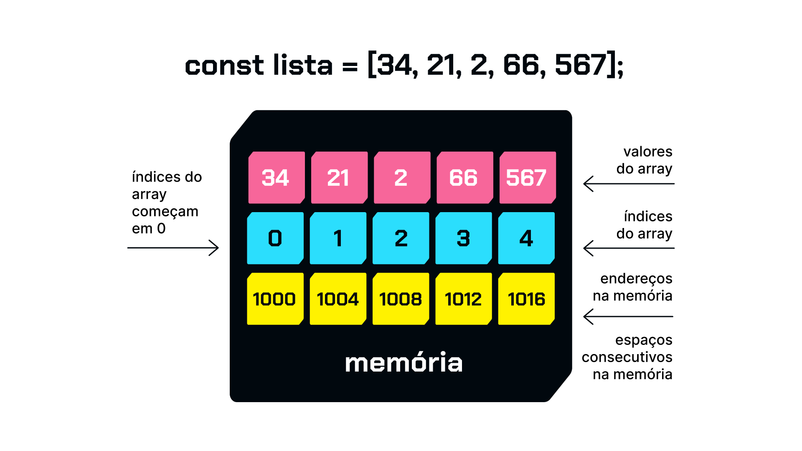

# Índices de array e memória

Os arrays são estruturas de dados que armazenam coleções de elementos. Cada elemento em um array é acessado por meio de um índice, que é um número inteiro usado para identificar a posição desse elemento no array.

Quando se trata de como os índices são armazenados na memória em JavaScript, é importante entender que os arrays em JavaScript são implementados como objetos. Internamente, os índices são tratados como chaves (ou propriedades) de um objeto, onde cada chave é associada ao seu valor correspondente (o elemento do array).

A memória em JavaScript é gerenciada automaticamente pelo mecanismo do navegador ou do ambiente de execução. Quando você cria um array e adiciona elementos a ele, o mecanismo aloca espaço na memória para armazenar esses elementos sequencialmente, de acordo com seus índices.

Por exemplo, ao criar um array, a memória poderia ser representada de forma simplificada como:

Cada elemento está localizado em um espaço de memória sequencial, e o acesso aos elementos do array é feito diretamente por meio dos índices correspondentes.

Resumindo, os índices de um array em JavaScript são números inteiros que representam a posição de cada elemento no array. Internamente, esses índices são tratados como chaves de um objeto, e os elementos são armazenados sequencialmente na memória conforme são adicionados ao array. Isso permite acessar rapidamente os elementos usando seus índices correspondentes.

[Arrays](../arrays.md)